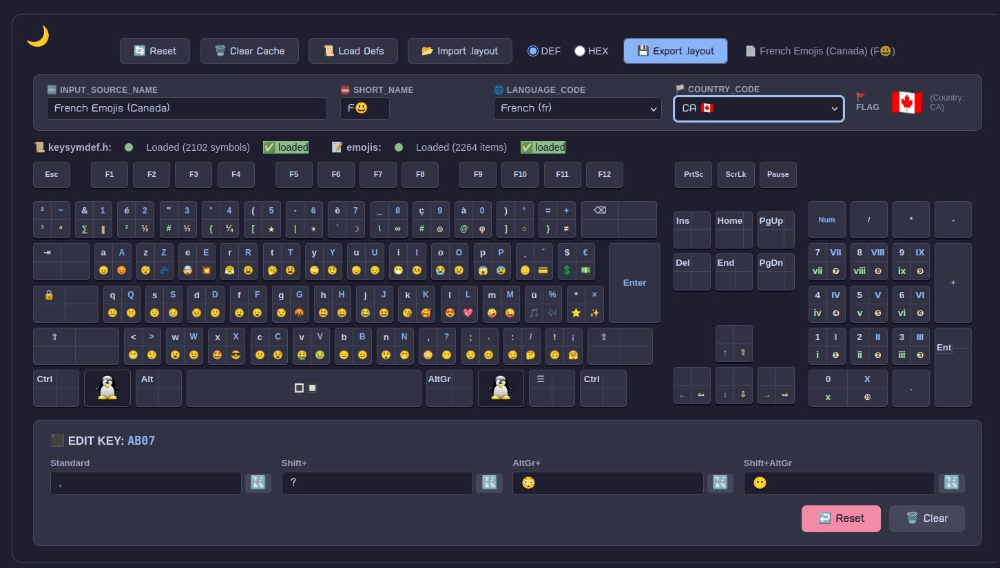
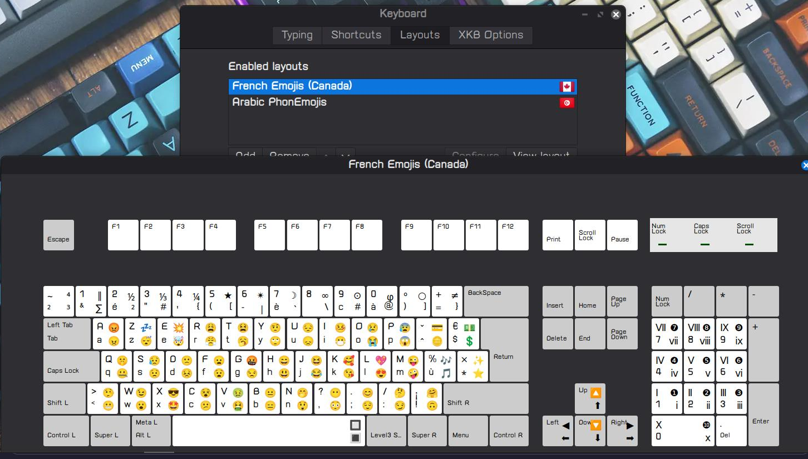
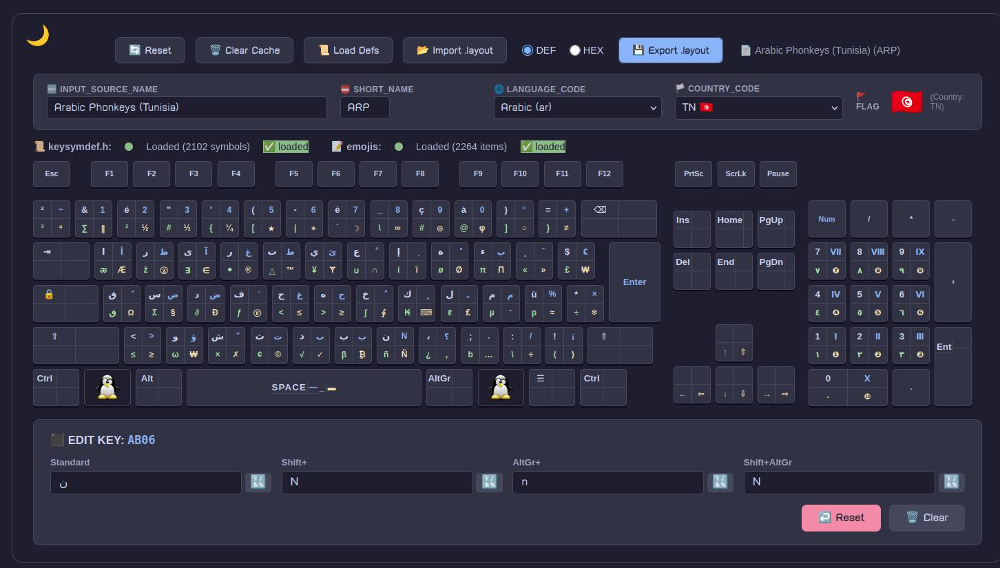
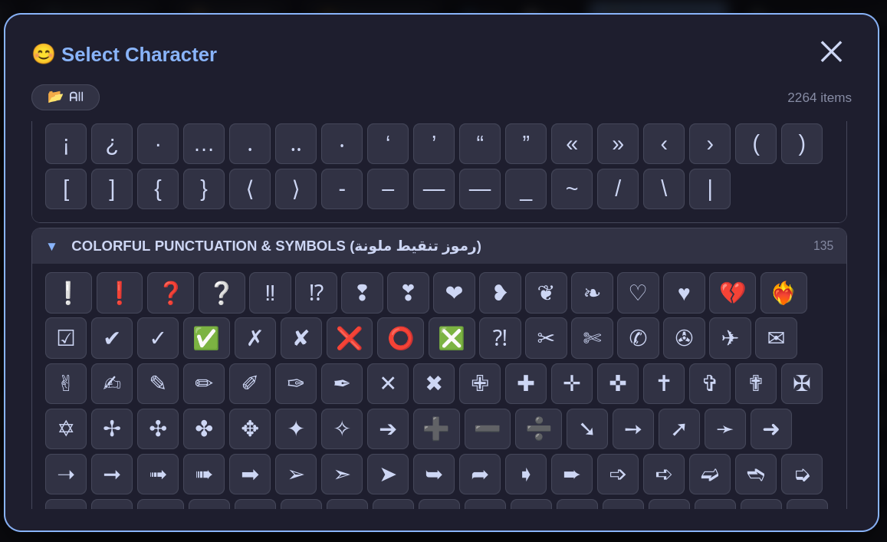
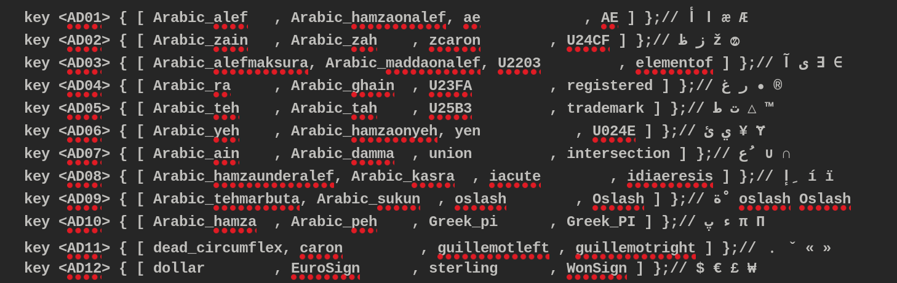
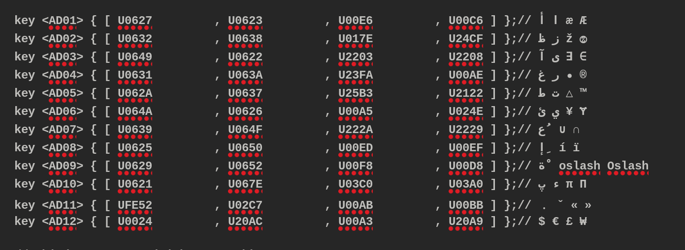
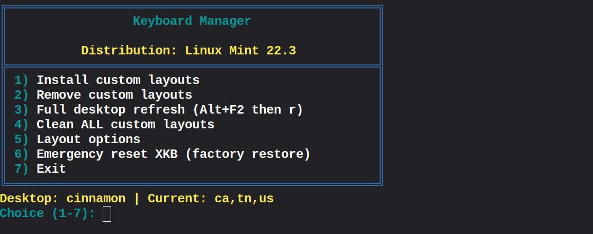
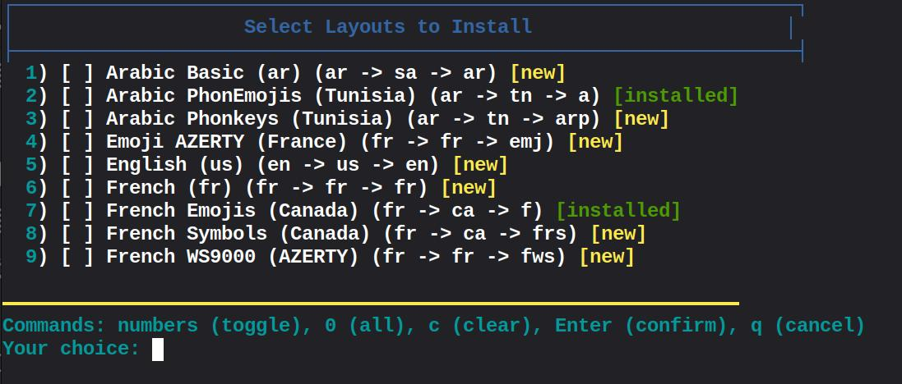
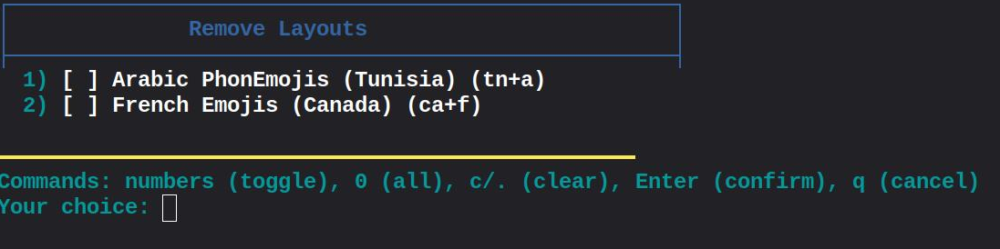
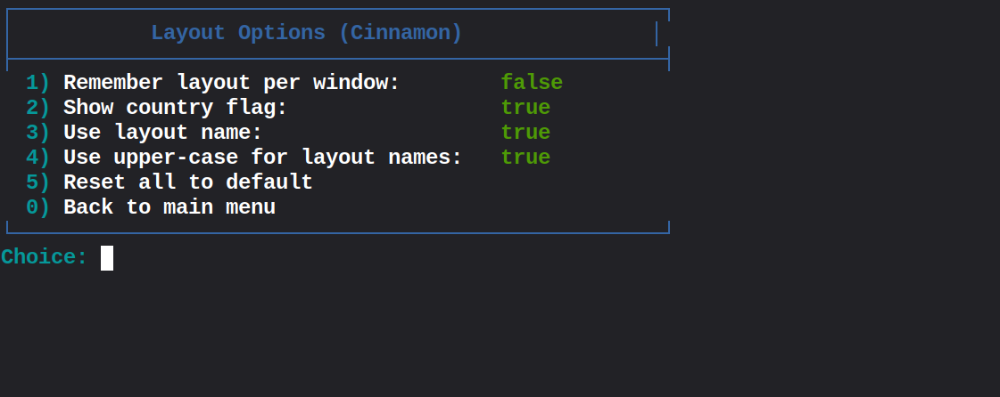

# ISO 105 Keyboard Layout Editor

A professional web-based editor for creating and customizing ISO 105 keyboard layouts with full support for 4-level key mappings (Standard, Shift, AltGr, Shift+AltGr). Export your layouts in `.layout` format compatible with XKB (X Keyboard Extension) for Linux desktop environments. The project includes a complete **Keyboard Manager** script for installing layouts on Linux Mint, Ubuntu, and Debian.


## 📸 Screenshots

| |
|:---:|
| **🎨 Editor View** |
|  |
| **📂 Input Sources** |
|  |
| **🎹 Phonkeys Layout** |
|  |
| **😊 Emojis & Symbols** |
|  |
| **🔣 Symbol Layout** |
|  |
| **🔣 DEF (Definition) export format** |
|  |
| **🔣 HEX (Hexadecimal) export format** |
|  |
| **⌨️ Keyboard Manager** |
|  |
| **⌨️ Install menu** |
|  |
| **⌨️ Remove menu** |
|  |
| **⌨️ Install menu** |
|  |

## ✨ Features

### 🎹 Interactive Keyboard
- **Complete ISO 105 layout** with all keys including number row, function keys, navigation cluster, arrow keys, and full numpad
- **4-level key display** showing Standard, Shift, AltGr, and Shift+AltGr combinations
- **Real-time editing** - click any key or press it on your physical keyboard to modify its four levels
- **Responsive design** - adapts to screen sizes from desktop to mobile
- **Protected keys** - Function keys (F1-F12, Esc, PrtSc, ScrLk, Pause) and Numpad operators (+, -, *, /, ., Num) are locked for safety

### 🛠️ Editing Capabilities
- **Key-level editing** - assign any character or symbol to each of the 4 levels
- **Emoji picker** - browse and insert emojis and special symbols with categorized sections (all single-code-point emojis for XKB compatibility)
- **Import/Export** - save and load `.layout` files for sharing or backup
- **Reset functionality** - reset individual keys or the entire layout
- **Export modes**: DEF (symbol names) or HEX (Unicode code points)
- **Physical keyboard shortcuts** - press any key on your real keyboard to open its editor instantly

### 🌍 Internationalization
- **Language support** - select from 10 languages (Arabic, English, French, German, Spanish, Italian, Portuguese, Russian, Japanese, Chinese)
- **Country-specific layouts** - automatic flag display based on country selection
- **Multi-level mapping** - support for special characters used in different languages
- **Tux logo** - Linux Penguin displayed on Win keys (LWIN, RWIN)

### 🔧 Technical Features
- **keysymdef.h integration** - loads standard XKB symbol definitions
- **Cache system** - stores definitions locally for offline use
- **Light/Dark theme** - comfortable editing in any lighting condition
- **Responsive UI** - optimized for all screen sizes
- **Popup notifications** - clean, non-intrusive feedback for protected keys and actions
- **Single-code-point emoji support** - all emojis are XKB-compatible

## 🚀 Quick Start

### Online Usage
1. Open `keys_editor.html` in any modern web browser
2. Click **"Load Defs"** to load keysymdef.h and emoji definitions (optional but recommended)
3. Start editing keys by clicking on any key **or pressing it on your physical keyboard**
4. Use the toolbar to import/export layouts

### Offline Usage
The editor works completely offline once loaded. All data is stored in your browser's localStorage.

### Keyboard Shortcuts
| Action | Description |
|--------|-------------|
| Click key | Open editor for that key |
| Press physical key | Open editor for the corresponding key |
| Enter in level field | Auto-update key display |
| 🔣 button | Open emoji picker |

### Layout File Format
The editor uses a custom `.layout` format compatible with XKB:
```xkb
key <TLDE> { [ twosuperior   , asciitilde    , ~             , ³ ] };   // ² ~ ~ ³
key <AE01> { [ ampersand     , 1             , function      , U2225 ] };  // & 1 ƒ ∥
```

## 📋 Installation

### Prerequisites
- Modern web browser (Chrome, Firefox, Edge, Safari)
- Optional: `keysymdef.h` file from XKB data directory (`/usr/include/X11/keysymdef.h`)
- Optional: `emojis_and_symbols.txt` for emoji support
- **For Linux installation**: Keyboard Manager script (included)

### Installation Steps
1. Clone the repository:
```bash
git clone https://github.com/Warren-15/Linux-keyboard-manager-mint-.git
cd Linux-keyboard-manager-mint-
```

2. Open the editor:
```bash
# Simply open in browser
open keys_editor.html
# or
firefox keys_editor.html
```

3. (Optional) Load definition files:
   - Click **"Load Defs"** button
   - Select your `keysymdef.h` file
   - Select your `emojis_and_symbols.txt` file

## 🎯 Usage Guide

### Basic Workflow
1. **Load Definitions** (optional) - Click "Load Defs" to load XKB symbols and emojis
2. **Edit Keys** - Click any key **or press it on your physical keyboard** to open the editor panel
3. **Set Levels** - Fill in the four level inputs:
   - Standard: Default character
   - Shift+: Character with Shift modifier
   - AltGr+: Character with AltGr modifier
   - Shift+AltGr: Character with both modifiers
4. **Export** - Click "Export .layout" to download your custom layout
5. **Import** - Use "Import .layout" to load existing layouts

### Protected Keys
The following keys are **locked** and cannot be edited:
- **Function keys**: Esc, F1-F12, PrtSc, ScrLk, Pause
- **Numpad operators**: +, -, *, /, ., Num Lock
- **Arrow keys**: Standard and Shift levels are fixed (AltGr and Shift+AltGr are editable)

### Level Mappings Explained
| Level | Modifier | Typical Use |
|-------|----------|-------------|
| Level 1 | None | Standard character (e.g., `a`, `1`) |
| Level 2 | Shift | Uppercase or shifted symbol (e.g., `A`, `!`) |
| Level 3 | AltGr | Third-level characters (e.g., `@`, `#`) |
| Level 4 | Shift+AltGr | Fourth-level characters (e.g., `~`, `€`) |

## 🛠️ Keyboard Manager

The included **Keyboard Manager** bash script simplifies installing custom layouts on Linux systems (Ubuntu, Linux Mint, Debian).

### Features
- **Install custom layouts** - install any `.layout` file system-wide
- **Remove custom layouts** - clean uninstallation
- **Full desktop refresh** - apply changes without restarting (Alt+F2 + r)
- **Clean all custom layouts** - remove all user-installed layouts
- **Layout options** - configure Cinnamon keyboard settings (per-window, flags, layout names, upper-case)
- **Emergency reset** - restore factory XKB settings

### Usage
```bash
# Make the script executable
chmod +x Keyboard_installer.sh

# Run the manager
./Keyboard_installer.sh
```

### Menu Options
```
┌────────────────────────────────────────────────────┐
│                Keyboard Manager                    │
├────────────────────────────────────────────────────┤
│  Distribution: Linux Mint 21.3                    │
├────────────────────────────────────────────────────┤
│  1) Install custom layouts                       │
│  2) Remove custom layouts                        │
│  3) Full desktop refresh (Alt+F2 then r)         │
│  4) Clean ALL custom layouts                     │
│  5) Layout options                               │
│  6) Emergency reset XKB (factory restore)        │
│  7) Exit                                         │
└────────────────────────────────────────────────────┘
```

### Layout Options (Cinnamon)
```
┌────────────────────────────────────────────────────┐
│           Layout Options (Cinnamon)               │
├────────────────────────────────────────────────────┤
│  1) Remember layout per window:        true       │
│  2) Show country flag:                 true       │
│  3) Use layout name:                   true       │
│  4) Use upper-case for layout names:   false      │
│  5) Reset all to default                          │
│  6) Back to main menu                            │
└────────────────────────────────────────────────────┘
```

## 🔄 Linux Mint/Cinnamon Support

The Keyboard Manager is specifically designed for **Linux Mint with Cinnamon desktop**, but also works on:
- **Ubuntu** (with GNOME or Cinnamon)
- **Debian** (with Cinnamon)
- **Other distributions** using XKB and GSettings

### Configuration Files
- **Layouts installed to**: `/usr/share/X11/xkb/symbols/`
- **GSettings schema**: `org.cinnamon.desktop.input-sources`
- **GSettings keys**:
  - `per-window` - Remember layout per window
  - `keyboard-layout-show-flags` - Show country flags
  - `keyboard-layout-prefer-variant-names` - Use layout names
  - `keyboard-layout-use-upper` - Use uppercase layout names

### Quick Commands
```bash
# Install a layout
./Keyboard_installer.sh
# Select option 1, then choose your .layout file

# Refresh desktop
./Keyboard_installer.sh
# Select option 3

# Reset all layouts
./Keyboard_installer.sh
# Select option 4
```

## 📦 Export File Structure

The exported `.layout` file follows this structure:

```
# ================================================================
# Layout Definition File for US.layout
# ================================================================

# ⚙️ BASIC INFO
INPUT_SOURCE_NAME="English (US)"
SHORT_NAME="US"
LANGUAGE_CODE="en"
COUNTRY_CODE="US"
FLAG="🇺🇸"

# First row - Numbers and symbols
# Standard:    ² & é " '"'"' ( - è _ ç à ) =
# Shift:       ~ 1 2 3 4 5 6 7 8 9 0 ° +
# AltGr:       ³ | ² # { [ ± ` \ # @ ] }
# AltGr+Shift: ⁴ ∥ ½ ⅓ ¼ ★ ✴ ☾ ∞ ⊙ φ ○ ≠

key <TLDE> { [ twosuperior   , asciitilde    , ~             , ³ ] };   // ² ~ ~ ³
key <AE01> { [ ampersand     , 1             , function      , U2225 ] };  // & 1 ƒ ∥
```

### Export Modes
| Mode | Description |
|------|-------------|
| **DEF** | Uses XKB symbol names (e.g., `twosuperior`, `asciitilde`) |
| **HEX** | Uses Unicode code points (e.g., `U00B2`, `U007E`) |

## 📁 File Structure

```
Linux-keyboard-manager-mint-/
├── keys_editor.html          # Main editor application
├── Keyboard_installer.sh     # Linux installation helper
├── README.md                 # This documentation
├── Data/
│   └── tux.png              # Linux Tux logo for Win keys
├── Sources/                  # Keyboard manager source files
│   ├── install.sh
│   ├── uninstall.sh
│   ├── refresh.sh
│   ├── clean_reset.sh
│   └── lib_common.sh
├── Layouts/                  # Example layout files
│   ├── AR_Phonkeys.layout.txt
│   ├── FR_symbol.layout.txt
│   └── FR_emojis.layout.txt
└── Screens/                  # Screenshots
    ├── keys_editor.png
    ├── manager.png
    ├── options.png
    ├── phnkeys.png
    ├── emojis.png
    └── symbols.png
```

## 🔧 Troubleshooting

### Common Issues

**Q: The emoji picker shows no emojis**
- Click "Load Defs" and select an `emojis_and_symbols.txt` file
- Or use the default emojis automatically loaded

**Q: Exported layout shows names like `twosuperior` instead of actual characters**
- This is normal when using DEF mode - the file stores symbol names
- Use HEX mode if you prefer Unicode code points (e.g., `U00B2`)

**Q: Changes don't appear on my Linux system**
- After exporting, use Keyboard Manager to install
- Refresh your desktop environment (Alt+F2, then type `r`)

**Q: Some keys don't show correct symbols**
- Load a valid `keysymdef.h` file
- Or use HEX mode for explicit Unicode code points

**Q: Function keys or Numpad operators cannot be edited**
- These keys are **protected** by design
- They are essential system keys that should not be modified

**Q: Physical keyboard shortcuts don't work**
- Make sure you're not typing in an input field
- Click anywhere on the page to focus it, then press the key

## 🚀 Future Enhancements

- [ ] Multiple layout support (switch between layouts)
- [ ] Layout preview with real keyboard rendering
- [ ] Dead key support
- [ ] Keyboard shortcut export (E.g., Compose key sequences)
- [ ] User-defined categories in emoji picker
- [ ] Cloud storage for layouts
- [ ] GNOME and KDE support in Keyboard Manager
- [ ] GUI installer for layouts
- [ ] Layout validation and error checking

## 🤝 Contributing

Contributions are welcome! Here's how you can help:

1. **Fork** the repository
2. **Create** a feature branch (`git checkout -b feature/amazing-feature`)
3. **Commit** your changes (`git commit -m 'Add amazing feature'`)
4. **Push** to the branch (`git push origin feature/amazing-feature`)
5. **Open** a Pull Request

### Development Guidelines
- Keep the single-file HTML structure
- Ensure responsive design works on all devices
- Maintain support for both light and dark themes
- Add comments for complex functions
- Test across different browsers
- Ensure all emojis are single-code-point (XKB compatible)

## 📄 License

This project is licensed under the MIT License - see below:

```
MIT License

Copyright (c) 2026 Keyboard Layout Editor Contributors

Permission is hereby granted, free of charge, to any person obtaining a copy
of this software and associated documentation files (the "Software"), to deal
in the Software without restriction, including without limitation the rights
to use, copy, modify, merge, publish, distribute, sublicense, and/or sell
copies of the Software, and to permit persons to whom the Software is
furnished to do so, subject to the following conditions:

The above copyright notice and this permission notice shall be included in all
copies or substantial portions of the Software.

THE SOFTWARE IS PROVIDED "AS IS", WITHOUT WARRANTY OF ANY KIND, EXPRESS OR
IMPLIED, INCLUDING BUT NOT LIMITED TO THE WARRANTIES OF MERCHANTABILITY,
FITNESS FOR A PARTICULAR PURPOSE AND NONINFRINGEMENT. IN NO EVENT SHALL THE
AUTHORS OR COPYRIGHT HOLDERS BE LIABLE FOR ANY CLAIM, DAMAGES OR OTHER
LIABILITY, WHETHER IN AN ACTION OF CONTRACT, TORT OR OTHERWISE, ARISING FROM,
OUT OF OR IN CONNECTION WITH THE SOFTWARE OR THE USE OR OTHER DEALINGS IN THE
SOFTWARE.
```

## 🙏 Acknowledgments

- **XKB** - The X Keyboard Extension that makes custom layouts possible
- **ISO 105** - The keyboard layout standard this editor is based on
- **Linux Mint** - For the excellent Cinnamon desktop environment
- **All contributors** - For testing, feedback, and improvements

## 📞 Support

- **Issues**: [GitHub Issues](https://github.com/Warren-15/Linux-keyboard-manager-mint-/issues)
- **Discussions**: [GitHub Discussions](https://github.com/Warren-15/Linux-keyboard-manager-mint-/discussions)
- **Email**: mr.dabbabi@gmail.com

---

**Built with ❤️ for the Linux community**
